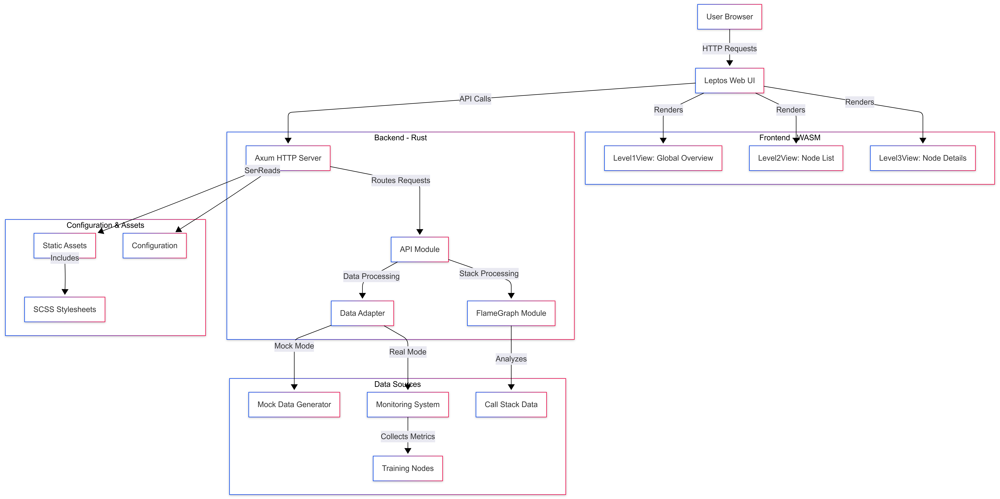

# Super Training Collector 项目汇报

> 面向千卡级分布式训练的可视化监控与诊断平台

---

## 一、项目背景

随着大模型训练规模扩展到千卡甚至万卡级别，训练任务运行时的可观测性成为关键挑战：

- **故障定位难**：单卡故障、慢节点、通信抖动等问题在大规模集群中难以快速感知与定位。
- **性能瓶颈隐蔽**：Step Time 抖动、GPU 利用率下降、NCCL 通信延迟等指标分散在各节点上，缺乏统一的展示入口。
- **HANG 难以察觉**：训练进程卡住（HANG）后，传统日志监控难以及时报警。

**Super Training Collector** 旨在通过统一的 Web 监控面板，为分布式训练任务提供从全局态势到单 Rank 级别的可视化诊断能力。

---

## 二、项目目标

1. 构建千卡级分布式训练监控平台，实时呈现任务运行状态。
2. 提供 **全局 → 节点 → Rank** 的三级下钻视图，支持快速定位异常。
3. 集成 HANG 检测、火焰图分析等诊断能力，缩短问题定位时间。
4. 基于 Rust + Leptos 全栈方案，保证性能与可维护性。

---

## 三、核心亮点

| 亮点 | 说明 |
| ---- | ---- |
| 一屏总览训练态势 | 聚合健康分布、全局 KPI、训练进度与 HANG 状态 |
| 千卡规模快速下钻 | 全局 → 节点 → Rank 三级视图，逐层定位异常 |
| 性能瓶颈可视化 | Step Time、GPU 利用率、NCCL 延迟、慢节点占比 |
| 火焰图辅助诊断 | 调用栈采集 + 火焰图可视化，支撑根因分析 |
| 演示友好 | 内置模拟数据模式，便于产品介绍与功能演示 |

---

## 四、技术方案

### 技术栈

| 类别 | 技术 |
| ---- | ---- |
| 框架 | [Leptos](https://leptos.dev/) 0.8（全栈 Rust Web 框架） |
| 后端 | Axum 0.8 |
| 前端 | WebAssembly (`wasm32-unknown-unknown`) |
| 样式 | SCSS |
| 测试 | Playwright（E2E） |

### 架构图

---

## 五、视图层级

| 层级    | 视图     | 描述                                     |
| ------- | -------- | ---------------------------------------- |
| Level 1 | 全局态势 | 健康分布、全局 KPI、拓扑热力图、HANG 指示 |
| Level 2 | 节点列表 | 节点性能表格，支持排序/筛选              |
| Level 3 | 节点详情 | 单节点 Rank 级指标详情、调用栈与火焰图    |

热力编码：🟢 正常 / 🟡 警告 / 🔴 故障，颜色直观呈现节点健康。

---

## 六、关键能力

### 1. 全局态势监控

- 健康节点分布与 KPI 聚合
- 训练进度展示（已完成 Step / 总 Step）
- HANG 状态全局指示

### 2. 节点 / Rank 级下钻

- 按节点维度展示 Step Time、GPU 利用率、NCCL 延迟
- 单节点支持 Rank 级别细分，定位慢 Rank

### 3. HANG 检测

- 间隔检测（详见 `docs/hang_check_in_interval(phase3).md`）
- 训练卡死时第一时间在面板报警

### 4. 性能分析

- 调用栈采集（`flamegraph/stack_collector.rs`）
- 火焰图可视化（`flamegraph/flamegraph_generator.rs`）

---

## 七、核心指标

| 指标            | 说明           | 单位 |
| --------------- | -------------- | ---- |
| Step Time       | 训练步骤耗时   | ms   |
| GPU Utilization | GPU 利用率     | %    |
| NCCL Latency    | 集合通信延迟   | ms   |
| Slow Ratio      | 慢 Rank 占比   | %    |

健康状态枚举：`Healthy` / `Warning` / `Critical`。

---

## 八、适用场景

| 场景     | 价值                                         |
| -------- | -------------------------------------------- |
| 项目介绍 | 展示千卡级训练监控平台的整体能力与技术架构    |
| 运维大屏 | 实时呈现训练任务健康状态、进度和异常告警      |
| 性能优化 | 对比关键指标，定位慢节点、慢 Rank 与通信瓶颈   |
| 问题复盘 | 结合火焰图与 Step 记录还原问题定位过程        |

---

## 九、项目进展

- ✅ Phase 1：Dashboard 全局态势视图（`docs/Dashboard_(phase1).md`）
- ✅ Phase 2：Step 指标采集与展示（`docs/metric_step_(phase2).md`）
- ✅ Phase 3：HANG 间隔检测（`docs/hang_check_in_interval(phase3).md`）
- ✅ 火焰图模块上线
- ✅ deb 打包与 systemd 部署支持

---

## 十、后续规划

- 接入更多训练框架的指标源
- 增强多任务并行监控能力
- 完善告警通道（已支持钉钉机器人）
- 持续完善 E2E 测试覆盖

---

## 附：相关文档

- 设计文档：`docs/Collector Design V0.1.md`
- 架构图：`docs/architecture.mmd` / `docs/architecture.svg`
- 各阶段设计：`docs/Dashboard_(phase1).md`、`docs/metric_step_(phase2).md`、`docs/hang_check_in_interval(phase3).md`
- 测试报告：`docs/TEST_COMPLETION_REPORT.md`
- Leptos 入门：`docs/leptos-start.md`
